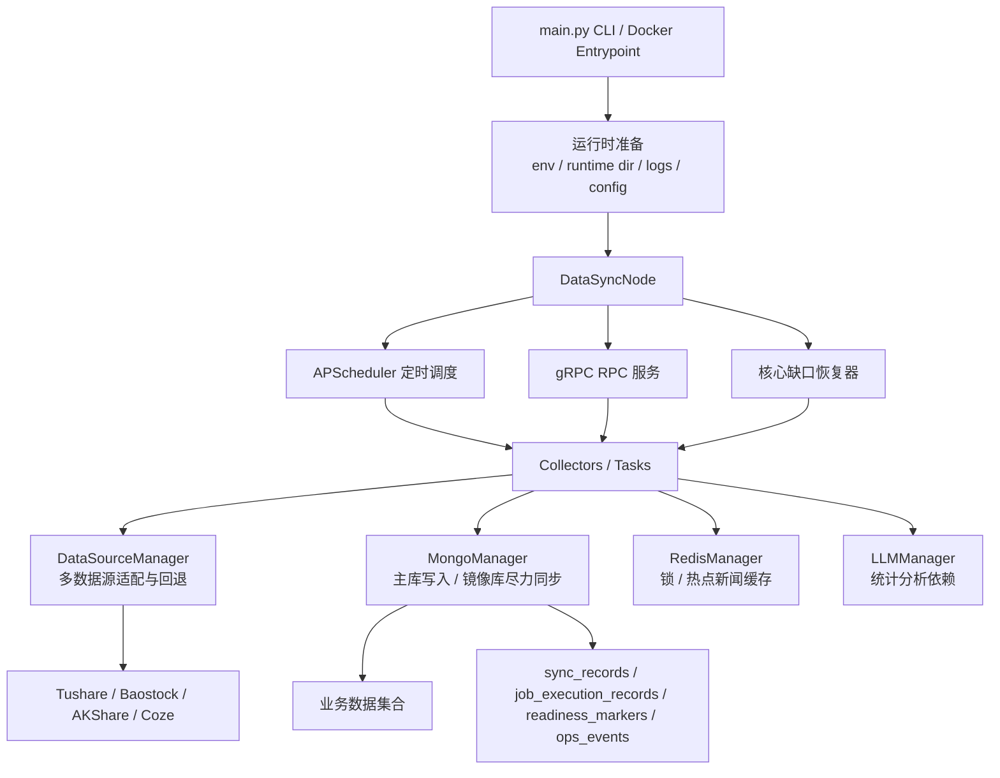

# DataSync 重构版技术架构与数据能力说明

本文档描述当前工作区中 `DataSync/` 重构版的数据同步服务设计、已具备的功能能力，以及它能对外提供的数据更新能力。它更接近“能力契约文档”，不是 Web 业务接口文档。

> 注意：当前 `DataSync/` 目录仍是独立重构线的工作区状态，和已经提交到 `AgentServer` 内部 DataSync 的稳定性改造不是同一个交付边界。本文描述的是当前代码具备的设计与能力，生产是否已启用需要以部署配置和镜像版本为准。

旧 `AgentServer/nodes/data_sync` 与独立 `DataSync/` 的替换边界见 [DataSync 迁移边界与灰度计划](/Users/shangjunhao/Project/StockAgent/docs/DATASYNC_MIGRATION_PLAN.md)。`market_weather` 股票晴雨表已迁移到独立 DataSync，正式下线旧链路前仍需要生产灰度验证。

## 1. 当前技术架构

### 1.1 服务定位

重构版 `DataSync` 被设计成一个独立的数据同步服务，目标是从原来的 `AgentServer` 内部节点中收敛出来，成为可以单独部署、单独配置、单独诊断的数据服务。

核心定位：

- 负责外部数据源到本地 MongoDB / Redis 的同步。
- 负责核心交易日数据的完整性检查、缺口恢复和就绪标记。
- 负责数据源调用的超时、降级、回退和运行统计。
- 负责向 Web、运维脚本或其他服务提供轻量 RPC 运维能力。
- 不直接承载业务页面逻辑，也不直接定义选股、监听、交易等业务接口。

### 1.2 架构分层



### 1.3 主要模块职责

| 模块 | 职责 |
| --- | --- |
| `DataSync/main.py` | 独立入口，负责加载环境、准备运行目录、执行 CLI 检查/恢复/运维命令，或启动常驻服务。 |
| `DataSync/nodes/data_sync/node.py` | 数据同步节点核心，负责注册任务、定时调度、分布式锁、RPC 方法、核心流水线、缺口恢复、就绪标记。 |
| `collectors/` | 原始数据采集器，负责从外部数据源拉取股票、指数、资金流、复盘、新闻、财务等数据。 |
| `tasks/` | 本地处理任务，负责对已同步数据进行统计、预聚合、缓存化处理。 |
| `services/core_integrity.py` | 核心链路完整性检查，判断最近交易日核心数据是否齐全。 |
| `services/ops_summary.py` | 运维摘要，整合就绪状态、失败任务、运行耗时、数据源退化、运维事件。 |
| `core/managers/data_source_manager.py` | 多数据源统一入口，负责源优先级、超时控制、失败回退、调用统计。 |
| `core/managers/mongo_manager.py` | MongoDB 访问、索引、同步记录、执行记录、就绪标记、主库/镜像库写入状态。 |
| `core/managers/redis_manager.py` | Redis 连接、分布式锁、热点新闻缓存等。 |

### 1.4 常驻运行流程

1. 加载 `DataSync/.env` 或 `DataSync/.env.docker`。
2. 初始化运行目录、日志目录、数据目录和本地 Milvus 路径。
3. 初始化 Redis、MongoDB、数据源管理器、LLM 管理器。
4. 启动 gRPC RPC 服务。
5. 注册所有采集器和处理任务。
6. 注册 APScheduler 定时任务。
7. 注册内部核心缺口恢复任务 `core_gap_recovery`。
8. 如配置允许，启动后延迟执行一次最近窗口缺口恢复。
9. 常驻运行，等待定时任务、RPC 手动触发或恢复任务触发。

### 1.5 核心收盘后流水线

`stock_daily` 成功后，会立即触发一条串行核心流水线：

```text
stock_daily
  -> index_daily
  -> daily_basic
  -> moneyflow_industry
  -> moneyflow_concept
  -> limit_list
  -> stock_relations
  -> daily_stats
  -> market_statistics_cache
```

设计意图：

- 让核心市场页面尽快可用，而不是只等固定 cron 时间。
- 任一环节失败后暂停后续链路，避免错误扩散。
- 保留原 cron 作为兜底重试入口。
- 每个任务都记录执行日志，便于追踪失败位置。

### 1.6 运行保障机制

| 机制 | 当前能力 |
| --- | --- |
| 分布式锁 | 每个任务运行前使用 Redis 锁，避免多个节点重复同步同一天数据。 |
| 执行记录 | 每次任务执行写入 `job_execution_records`，记录触发来源、目标交易日、耗时、状态、错误。 |
| 同步记录 | 数据集同步完成后写入 `sync_records`，保留旧系统兼容口径。 |
| 就绪标记 | 核心链路写入 `readiness_markers`，表达某个交易日核心市场数据是否 ready。 |
| 运维事件 | 核心任务失败、恢复完成、恢复失败等写入运维事件。 |
| 断点续拉 | 长任务写入 `datasync_checkpoints`，记录已完成交易日或股票代码游标，中断后从安全位置继续。 |
| 闲时补缺 | 重型任务和显式 backfill/history 触发默认只在 `00:00-08:00` 运行，窗口外记录 skipped。 |
| 补缺队列 | 历史补缺进入 `datasync_backfill_jobs`，按优先级小批量领取，失败有尝试次数上限。 |
| 数据源回退 | 核心能力优先使用传统稳定源，单源超时后自动回退。 |
| 数据源统计 | 记录当前进程内每个方法/数据源的成功、失败、超时、空结果、回退情况。 |
| 近期缺口恢复 | 默认每 20 分钟检查最近 3 个交易日核心缺口，并从首个缺失数据集开始顺序恢复。 |
| 主库/镜像库 | 主库是唯一强依赖，镜像库可选，镜像失败不阻断主链路。 |
| 索引初始化收敛 | 启动默认只检查核心集合索引，健康/就绪探针不触发索引检查，非核心索引可在闲时手动补齐。 |
| 结构化日志与采样 | 任务生命周期输出稳定事件名和排障字段，坏数据日志按 `OBS_LOG_SAMPLE_LIMIT` 采样，长字段按 `OBS_LOG_MAX_VALUE_CHARS` 截断。 |

## 2. 当前能实现的功能

这里列的是“系统功能能力”，不是业务接口。

### 2.1 数据同步功能

| 功能 | 说明 |
| --- | --- |
| 定时同步 | 按 cron 定时执行股票、指数、资金流、复盘、财务、新闻等数据任务。 |
| 手动同步 | 通过 CLI 或 RPC 触发指定任务运行。 |
| 收盘后快速推进 | `stock_daily` 成功后自动推进核心市场链路。 |
| 首次历史补齐 | 部分任务支持首次运行时补一段历史数据，例如 `review_data`。 |
| 最近窗口补缺 | 对最近若干交易日检查核心数据缺口并尝试恢复；默认窗口 3 个交易日，最大 10 个交易日，最新交易日走顺序恢复，历史交易日走定向恢复。 |
| 单任务定向修复 | 对支持 `recover_trade_date` 的任务，按指定交易日进行修复。 |
| 同步跳过 | 已同步数据会按任务口径跳过，降低重复抓取和重复写入。 |
| 断点续拉 | `stock_daily` 增量按交易日续跑、历史扫描按股票代码和日期窗口续跑，后续采集器可复用同一 checkpoint 契约。 |
| 闲时补缺窗口 | `heavy` 任务和显式 `backfill/history` 触发受 `SYNC_BACKFILL_WINDOW_START/END` 控制，人工命令可用 `--force` 明确绕过。 |
| 历史补缺队列 | 支持人工入队、查看队列、闲时 worker 单轮消费和失败重试上限；恢复执行仍复用各任务 `recover_trade_date`。 |

### 2.2 数据完整性与可用性功能

| 功能 | 说明 |
| --- | --- |
| 最新交易日识别 | 通过数据源获取最新交易日，用于判定目标同步日期。 |
| 核心链路完整性检查 | 检查最近 N 个交易日核心数据集是否覆盖完整，并区分 ready、missing、warning 与 waiting window。 |
| 核心 ready marker | 在核心数据齐全后写入 `market_core_ready` 标记，供 Web 或运维判断可用状态。 |
| 等待窗口识别 | 未到收盘后同步窗口时，不把盘中缺失误判成故障。 |
| 最近窗口严格检查 | 可要求最近 N 个交易日全部 ready，否则命令返回非 0。 |

核心完整性检查的判断口径：

| 状态 | 含义 |
| --- | --- |
| `ready` | 真实集合覆盖达到最低要求。 |
| `missing` | 真实集合缺失，且没有可接受的目标交易日成功执行记录。 |
| `warning` | 有数据但数量明显偏低，例如股票日线或每日指标覆盖率低于阈值。 |
| `waiting_window` | 最新交易日还没到配置的核心同步时间窗，不作为阻断缺口。 |

除 `limit_list` 这类可能天然零记录的数据外，完整性检查不使用旧 `sync_records` 直接判定 ready，避免同步标记前进但真实集合未落库。

### 2.3 运维诊断功能

| 功能 | 说明 |
| --- | --- |
| 启动检查 | 检查环境、配置、管理器、调度器、RPC、数据源是否可初始化。 |
| 独立性审计 | 检查 `DataSync/` 是否错误依赖 `AgentServer` 或其他服务目录。 |
| 最近失败任务查询 | 查看最近失败的任务，可限制只看核心任务。 |
| 最近运维事件查询 | 查看自动恢复、核心失败、告警等运维事件。 |
| 核心任务耗时摘要 | 查看近期核心任务成功率、最新耗时、p95 和异常长尾任务。 |
| 数据源调用统计 | 查看不同数据源的成功、失败、超时、回退、空结果情况。 |
| 数据源统计重置 | 重置当前进程内统计窗口，便于观察后续源端状态。 |
| 综合运维摘要 | 一次性输出完整性、主/镜像库、失败任务、事件、运行耗时、数据源退化。 |
| 数据能力声明 | 由任务类静态导出能力名、目标集合、依赖、调度、资源等级、恢复能力、可恢复性语义和质量规则，不读取运行状态。 |
| 结构化任务日志 | 任务开始、成功、失败、跳过、超时统一输出 `datasync_job_*` 事件，便于从 Docker 日志定位 job、交易日、来源和触发方式。 |

任务执行记录模型当前包含：

| 字段 | 说明 |
| --- | --- |
| `run_date` | 任务实际运行日期，避免和目标交易日混用。 |
| `target_trade_date` | 本次任务面向的交易日；核心任务缺失时会尽量推断为最新交易日。 |
| `data_cutoff_time` | 数据截止点，当前默认跟随任务返回值或目标交易日，后续可细化到分钟级。 |
| `resource_class` | `core`、`background` 或 `heavy`，用于调度和运维判断。 |
| `recoverability` | 本次任务对应数据的可恢复性声明；强时效或不可完整后补任务失败时会进入 warning/critical 运维事件。 |
| `source` | 任务返回的数据源标识；没有返回时保持为空，不能伪造。 |

旧 `sync_records` 继续保留，只作为兼容同步标记；新功能优先使用 `job_execution_records` 和真实集合覆盖检查。

### 2.4 资源保护功能

| 功能 | 说明 |
| --- | --- |
| 保守注册档 | `SYNC_PROFILE=conservative` 默认只注册核心市场链路，新闻、复盘、财务、板块重任务需显式启用。 |
| 任务资源分类 | DataSync 任务分为 `core`、`background`、`heavy`，便于调度、跳过、限流和运维展示。 |
| 重任务串行 | `heavy` 任务单独串行执行，避免财务、板块等任务叠加占用 CPU、内存和外部接口。 |
| 核心忙时跳过非核心 | 核心链路运行期间，定时触发的非核心任务会记录为 `skipped`，不抢核心行情同步资源。 |
| 热点新闻降压 | `hot_news` 默认关闭，并限制来源白名单、每轮来源数、每源条数、HTTP 超时和整轮总超时。 |
| 核心任务源超时 | 对核心数据源调用增加保守超时，避免单源卡死整条链路。 |
| 统一 HTTP 基座 | 对可控 REST 数据源统一超时、重试退避、`Retry-After`、429/503/5xx 分类；当前优先接入 Coze 工作流源。 |
| 显式回退链路 | 核心能力按 source chain 执行回退，调用统计会记录链路、已尝试来源、fallback from/to 和错误分类。 |
| 源级限流冷却 | `tushare/akshare/baostock/coze` 分别有令牌桶预算，429 后按源进入冷却并跳过该源继续回退。 |
| 入库前轻量校验 | 核心行情集合写库前校验必填字段、标准化交易日期并转换数值字段，坏记录会被隔离并记录样本。 |
| 死信样本归档 | 校验失败样本会受控写入 `datasync_dead_letters`，单批默认最多 20 条，ops summary 会展示近期样本和告警。 |
| 幂等批量写入 | 核心采集器统一走 `bulk_upsert_batched`，强制业务主键、按配置分批并返回 matched/modified/inserted/failed。 |
| 动态写入批次 | Mongo 写入慢批次会自动缩小，稳定后只恢复到本次请求上限；任务详情会记录 `batch_size_history`。 |
| 串行指数同步 | `index_daily` 只抓 3 个核心指数，采用串行方式降低波动。 |
| 高频任务隔离意识 | `hot_news` 被识别为高频高请求量任务，保守档默认不注册。 |
| 镜像库降级 | 镜像写失败只记 warning，不影响主库同步。 |
| 启动后延迟恢复 | 启动时恢复任务延迟执行，降低启动瞬间资源峰值。 |
| 恢复失败点 | 最新交易日恢复结果会返回 `rerun_order`、每步 `results`、`completed_jobs` 和 `failure_point`，便于二次排障。 |
| 最近窗口恢复明细 | 最近窗口恢复结果会返回 `recovered_trade_dates`、`skipped_trade_dates`、`failed_trade_dates` 和 `unsupported`，便于确认重启后补缺是否真正完成。 |
| 定向恢复契约 | 核心任务 `recover_trade_date` 会先校验交易日，并统一返回 `source/sources/warnings/failed_items`，非交易日跳过，交易日历源异常失败重试。 |
| 补缺每日预算 | 历史补缺队列默认每晚最多消费 24 个任务、300 次外部请求，连续失败 3 次熔断，并将预算状态写入 ops summary。 |
| 核心 SLA 时间窗 | 当天核心链路分为 `waiting_window`、`syncing_window`、`overdue`、`failed`，默认 `15:30` 开始观察、`16:10` 期望 ready、`17:00` 后明确失败。 |

## 3. 数据更新服务能力目录

这一节按“数据能力”描述，每一行都可以理解成一个内部数据更新服务。

机器可读目录已落在 [datasync_capabilities.yaml](/Users/shangjunhao/Project/StockAgent/DataSync/config/datasync_capabilities.yaml)。该文件由任务类静态声明生成，包含 `schema_version`、`profile`、`core_ready_datasets`、`source_chain_catalog` 和每个能力的目标集合、调度、依赖、恢复能力、可恢复性语义、资源等级、质量规则，不包含最近运行状态。

`recoverability.mode` 用于区分补缺策略：`full` 表示支持按交易日或历史窗口可靠补缺，`best_effort` 表示可重跑但历史上下文只能尽力恢复，`none` 表示错过采集窗口后无法可靠还原。`severity_on_missing` 决定任务失败时是否进入 warning/critical 运维事件。

Web 系统能力状态页提供补缺入队入口：`POST /api/v1/system/datasync/backfill-jobs` 只负责把能力目录中 `full/best_effort` 且支持恢复的数据集写入 `datasync_backfill_jobs`，实际执行仍由 DataSync 夜间 worker 按窗口、预算和熔断规则消费，避免人工操作绕过资源保护。队列人工操作通过 `PATCH /api/v1/system/datasync/backfill-jobs/{job_id}/action` 暴露 `pause/resume/retry`，仅允许安全状态转换，并将操作写入 `ops_events`。状态页会读取最近 72 小时最多 5 条运维事件用于展示，避免对 `ops_events` 做无界读取。

### 3.1 核心市场数据能力

| 能力名 | 类型 | 默认触发 | 目标数据 | 主要写入位置 | 可恢复 | 用途 |
| --- | --- | --- | --- | --- | --- | --- |
| `stock_basic` | 采集 | 工作日 09:00 | 股票基础信息、上市状态、估值字段合并 | `stock_basic` | 否 | 股票列表、名称、状态、基础属性。 |
| `index_basic` | 采集 | 工作日 09:00 | 指数基础信息 | `index_basic` | 否 | 指数元数据。 |
| `stock_daily` | 采集 | 工作日 15:30 | 全市场股票日 K | `stock_daily` | 是 | 核心行情、选股、统计、回测基础数据。 |
| `index_daily` | 采集 | 工作日 15:35 | 上证、深证、创业板等核心指数日 K | `index_daily` | 是 | 指数行情、市场环境、择时判断。 |
| `daily_basic` | 采集 | 工作日 16:00 | 全市场每日指标 | `daily_basic` | 是 | 估值、换手、量比、市值等指标。 |
| `moneyflow_industry` | 采集 | 工作日 16:00 | 行业资金流 | `moneyflow_industry` | 是 | 行业资金强弱、市场结构分析。 |
| `moneyflow_concept` | 采集 | 工作日 16:05 | 概念资金流 | `moneyflow_concept` | 是 | 概念题材资金强弱。 |
| `limit_list` | 采集 | 工作日 16:10 | 涨跌停列表 | `limit_list` | 是 | 涨停、跌停、连板、市场情绪分析。 |
| `stock_relations` | 处理 | 工作日 16:20 | 个股和板块/题材关系 | `stock_relations` 相关集合 | 否 | 股票与行业、概念、题材关联。 |
| `daily_stats` | 处理 | 工作日 16:30 | 市场统计、情绪、连板等聚合 | `daily_stats` 等统计集合 | 是 | 市场晴雨表、涨跌统计、行情分析基础。 |
| `market_statistics_cache` | 处理 | 工作日 16:35 | 市场统计预聚合缓存 | 市场统计缓存集合 | 是 | Web 市场统计页面快速读取。 |
| `market_weather` | 处理 | 工作日 18:50 | 股票晴雨表 | `market_weather_daily` | 是 | 盘后市场温度、做不做、做多少、做什么等交易环境参考。 |

核心 ready 判断当前关注这些数据集：

```text
stock_daily
index_daily
daily_basic
moneyflow_industry
moneyflow_concept
limit_list
daily_stats
market_statistics_cache
```

`market_weather` 属于保守档启用的重要数据，但依赖 Coze 市场指标工作流，当前不纳入 `market_core_ready` 硬门槛，避免源端波动影响核心行情 ready。

这些数据集在同一目标交易日都完整后，`readiness_markers` 会写入 `marker_type=market_core_ready` 的 ready 状态。

### 3.2 复盘与辅助数据能力

| 能力名 | 类型 | 默认触发 | 目标数据 | 主要写入位置 | 可恢复 | 用途 |
| --- | --- | --- | --- | --- | --- | --- |
| `review_data` | 采集 | 工作日 19:30 | 连板天梯、板块涨停、板块日线、龙虎榜、热股、北向资金 | `review_limit_step`、`review_sector_limit`、`review_sector_daily`、`review_dragon`、`review_hot`、`review_northbound` | 部分历史采集 | `background`，日终复盘、题材分析、强弱榜单。 |
| `ths_sector` | 采集 | 每周六 02:00 | 同花顺板块、成分股、个股映射 | `ths_sectors`、`stock_sector_map`、`sector_stocks` | 否 | `heavy`，板块分析、概念映射、个股归属。 |
| `fina_indicator` | 采集 | 每月 1 日 09:00 | 利润表、资产负债表、现金流、财务指标 | `fina_income`、`fina_balance`、`fina_cashflow`、`fina_indicator` | 否 | `heavy`，基本面分析、财务因子。 |

### 3.3 新闻与热点能力

| 能力名 | 类型 | 默认触发 | 目标数据 | 主要写入位置 | 当前状态 | 用途 |
| --- | --- | --- | --- | --- | --- | --- |
| `hot_news` | 采集 | 默认每 30 分钟，且需显式启用 | 多来源热点新闻榜单 | Redis 热点新闻缓存 | `background`，默认关闭并限流 | 首页热点、舆情观察。 |
| `stock_news` | 采集 | 工作日 18:30 | 涨跌停个股相关新闻 | `news`、Milvus 向量库 | `background`，当前 `collect()` 直接 `skip` | 预留给个股新闻/RAG。 |
| `event_clustering` | 处理 | 预留 | 新闻事件聚类 | 预留 | 当前未注册 | 后续新闻深度去重与事件化。 |
| `news_lifecycle` | 处理 | 预留 | 新闻生命周期清理 | 预留 | 当前未注册 | 后续控制新闻数据体量。 |

### 3.4 数据源优先级

当前核心能力倾向于传统稳定源优先：

| 能力 | 优先级 |
| --- | --- |
| `index_daily` | `tushare -> baostock -> akshare` |
| `latest_trade_date` | `tushare -> baostock -> akshare -> coze` |
| `trade_calendar` | `tushare -> baostock -> akshare -> coze` |
| 全市场 `daily` | `tushare -> baostock -> akshare -> coze` |
| 全市场 `daily_basic` | `tushare -> baostock -> akshare -> coze` |
| 财务数据 | 优先 `tushare` |

设计原则：

- 核心交易数据优先稳定性，不优先追求免费源或 AI 源。
- Coze 更适合单股、实时、增强型或非核心链路能力。
- 任一源超时或返回空数据时，可以进入回退链路。
- 可控 HTTP 源的限流、服务端错误、网络错误和非法 JSON 会显式记录到数据源调用统计，不能静默伪造成空数据或成功数据。
- 数据源链路可通过 `SYNC_SOURCE_CHAIN_OVERRIDES` 覆盖，例如 `get_daily.full_market=tushare,baostock,akshare`。覆盖后按配置链路执行，不额外追加其他来源。
- 如果链路内所有可尝试来源均报错，DataSync 会抛出链路错误；只有来源成功返回空集合时，才保留“空数据”语义。
- 数据源调用前会按 `SYNC_SOURCE_RATE_LIMITS` 获取源级令牌，默认 `tushare=200/m,akshare=60/m,baostock=60/m,coze=30/m`。源端返回 429 后，会按 `Retry-After` 或 `SYNC_SOURCE_RATE_LIMIT_COOLDOWN_SECONDS` 冷却该源；冷却期间跳过该源并继续回退，避免单个限频源卡住整条链路。
- 核心采集器写库前会执行最小 schema 校验；缺失关键字段的记录不会入库，日期会统一为 `YYYYMMDD`，数值字段会做安全转换。系统不会猜测缺失价格字段。
- 校验失败样本会进入 `datasync_dead_letters`，字段包含 `job_name`、`collection`、`source`、`target_trade_date`、`reason`、`raw_item`、`error_type` 和 `created_at`；单批写入上限由 `SYNC_DEAD_LETTER_MAX_RECORDS_PER_BATCH` 控制。
- 核心写库默认使用幂等 upsert，必须提供业务主键，初始批次大小由 `SYNC_BULK_UPSERT_BATCH_SIZE` 控制，最大不超过 `SYNC_BULK_UPSERT_MAX_BATCH_SIZE`；写入失败会抛出带批次错误的结构化异常，不会静默吞掉。
- 批量写入会根据单批耗时动态调整：超过 `SYNC_BULK_UPSERT_SLOW_BATCH_MS` 时缩小到不低于 `SYNC_BULK_UPSERT_MIN_BATCH_SIZE`，连续稳定 `SYNC_BULK_UPSERT_STABLE_BATCHES_TO_GROW` 批后只恢复到本次请求上限。返回值包含 `batch_size_history`，用于排查 Mongo 压力。

## 4. 运维与调用契约

这一节不是 HTTP API，而是当前 DataSync 对外提供的“操作能力”。

生产补数、排障和高风险命令边界以 [DataSync 生产补数操作手册](/Users/shangjunhao/Project/StockAgent/docs/DATASYNC_OPERATIONS.md) 为准。遇到“最近几天核心数据缺失”时，优先使用手册中的安全补数流程，不建议直接开放 MongoDB 端口或手动改库。

Docker 部署默认遵循下面的安全边界：

- MongoDB 和 Redis 的宿主机端口默认绑定 `127.0.0.1`，不对公网开放。
- 如果必须调整宿主机映射端口，使用 `MONGO_PUBLISHED_PORT` / `REDIS_PUBLISHED_PORT`；容器内连接端口仍保持 `MONGO_PORT=27017`、`REDIS_PORT=6379`。
- 独立 DataSync Compose 中 `data-sync`、`mongodb`、`redis` 都有保守资源上限；根目录简化 Compose 和 full Compose 的 `data-sync` 也使用 `DATA_SYNC_CPUS` / `DATA_SYNC_MEM_LIMIT`。

### 4.1 CLI 能力

| 命令 | 功能 | 典型用途 |
| --- | --- | --- |
| `python DataSync/main.py --check` | 检查配置、导入和任务注册 | 本地改动后快速确认服务能启动。 |
| `python DataSync/main.py --audit-self-contained` | 检查独立性 | 防止重构版重新依赖 `AgentServer`。 |
| `python DataSync/main.py --check-startup` | 初始化管理器、调度器、RPC 后退出 | 部署前确认 Redis、Mongo、数据源、RPC 能工作。 |
| `python DataSync/main.py --health` | 轻量健康检查 | Docker 探活；只检查配置、Redis、Mongo。 |
| `python DataSync/main.py --ready` | 轻量就绪检查 | 判断核心数据是否可用；只读 ready marker 和近期核心失败。 |
| `python DataSync/main.py --check-core-integrity --integrity-days 3` | 检查最近 3 个交易日核心完整性 | 判断最近数据是否缺失。 |
| `python DataSync/main.py --recover-latest-core-gaps` | 恢复最新交易日核心缺口 | 当天数据不全时优先使用。 |
| `python DataSync/main.py --recover-recent-core-gaps --integrity-days 3` | 恢复最近窗口核心缺口 | 补最近几天缺口。 |
| `python DataSync/main.py --safe-recover-core-window --integrity-days 4` | 检查、恢复、定向修复、再检查 | 安全补齐最近 N 个交易日。 |
| `python DataSync/main.py --recover-job-trade-date --job-name index_daily --trade-date 20260526` | 指定任务和交易日定向修复 | 已知某个任务某天缺失时使用。 |
| `python DataSync/main.py --recover-job-trade-date --job-name ths_sector --trade-date 20260526 --force` | 强制窗口外手动恢复 | 仅在确认服务器资源允许时使用。 |
| `python DataSync/main.py --check-sync-targets` | 查看主库/镜像库状态 | 排查 Mongo 连接和镜像写入状态。 |
| `python DataSync/main.py --ensure-indexes --index-scope core` | 手动确保核心索引 | 部署后或迁移后补齐核心集合索引。 |
| `python DataSync/main.py --ensure-indexes --index-scope all` | 手动确保全量索引 | 仅建议闲时执行，补齐非核心页面与历史功能索引。 |
| `python DataSync/main.py --ensure-indexes --index-collections stock_daily,index_daily` | 指定集合索引 | 只处理明确集合，降低索引维护影响面。 |
| `python DataSync/main.py --data-capabilities` | 输出能力目录 | 直接打印当前 profile 下的机器可读数据能力目录。 |
| `python DataSync/main.py --write-data-capabilities` | 写入能力目录 | 默认写入 `DataSync/config/datasync_capabilities.yaml`。 |
| `python DataSync/main.py --recent-failed-jobs` | 查看最近失败任务 | 排查同步失败。 |
| `python DataSync/main.py --recent-ops-events` | 查看最近运维事件 | 排查恢复、告警、核心失败。 |
| `python DataSync/main.py --recent-checkpoints --job-name stock_daily` | 查看最近 checkpoint | 判断长任务中断前停在什么交易日或股票代码。 |
| `python DataSync/main.py --enqueue-backfill-job --job-name stock_daily --trade-date 20260526` | 创建补缺队列任务 | 把某个数据集某个交易日加入夜间补缺队列。 |
| `python DataSync/main.py --recent-backfill-jobs --backfill-status pending` | 查看补缺队列 | 排查待执行、失败或暂停的补缺任务。 |
| `python DataSync/main.py --run-backfill-queue-once --force` | 手动消费一轮补缺队列 | 本地验证 worker；生产环境窗口外慎用 `--force`。 |
| `python DataSync/main.py --core-job-runtime-summary` | 查看核心任务运行摘要 | 排查慢任务和长尾。 |
| `python DataSync/main.py --data-source-call-stats` | 查看数据源调用统计 | 排查某个源是否超时或退化。 |
| `python DataSync/main.py --reset-data-source-call-stats` | 重置数据源调用统计 | 重新观察后续数据源状态。 |
| `python DataSync/main.py --ops-summary` | 输出综合运维摘要 | 最适合做人工排障或监控探针。 |
| `python DataSync/main.py --ops-summary --require-recent-window-ready` | 严格核心窗口探针 | 最近窗口不完整时返回非 0，适合监控告警。 |
| `python DataSync/main.py --ops-summary --require-no-recent-failures --require-no-warning-events` | 严格失败/告警探针 | 最近存在未解决失败或 warning/critical 运维事件时返回非 0。 |
| `python DataSync/main.py --ops-summary --require-no-core-data-source-degradation --require-no-core-runtime-outliers` | 严格退化/慢任务探针 | 核心数据源退化或核心任务耗时异常时返回非 0。 |

`ops-summary` 顶层会稳定输出：

- `operational_status`：`healthy`、`degraded` 或 `critical`。
- `probe_checks`：用于脚本判断的布尔检查集合。
- `backfill_queue_status`：历史补缺队列状态计数、预算状态和少量最近任务样本。

### 4.2 RPC 能力

| RPC 方法 | 参数 | 返回能力 |
| --- | --- | --- |
| `refresh_hot_news` | `source` 可选 | 刷新全部或指定来源热点新闻。 |
| `run_sync_job` | `job_name` | 手动运行指定同步任务。 |
| `get_core_readiness` | 无 | 返回最新核心 ready marker。 |
| `get_recent_job_executions` | `job_name` 可选，`limit` 可选 | 返回最近任务执行记录。 |
| `get_recent_failed_job_executions` | `limit`、`lookback_hours`、`core_jobs_only` | 返回最近失败任务。 |
| `get_recent_ops_events` | `limit`、`lookback_hours`、`severities` | 返回最近运维事件。 |
| `get_core_job_runtime_summary` | `lookback_hours` | 返回核心任务耗时和成功率摘要。 |
| `get_core_integrity_overview` | `days` | 返回最近 N 个交易日核心完整性概览。 |
| `recover_latest_core_gaps` | 无 | 尝试恢复最新交易日核心缺口。 |
| `recover_recent_core_gaps` | `days` | 尝试恢复最近 N 个交易日核心缺口。 |
| `recover_job_trade_date` | `job_name`、`trade_date` | 定向恢复指定任务和交易日。 |
| `get_sync_targets_status` | 无 | 返回主库/镜像库健康状态。 |
| `get_data_source_call_stats` | 无 | 返回当前进程内数据源调用统计。 |
| `reset_data_source_call_stats` | 无 | 重置当前进程内数据源统计窗口。 |
| `get_ops_summary` | `days`、`job_limit`、`lookback_hours` 等 | 返回综合运维摘要。 |
| `get_data_capabilities` | `registered_only` 可选 | 返回 DataSync 任务静态能力声明清单。 |

### 4.3 就绪状态契约

`get_core_readiness` 或 `readiness_markers` 中的 `market_core_ready` 可以作为 Web 判断核心市场数据是否可用的依据。

核心字段含义：

| 字段 | 含义 |
| --- | --- |
| `marker_type` | 当前固定为 `market_core_ready`。 |
| `trade_date` | 当前 marker 对应的交易日。 |
| `status` | `ready` 表示核心链路齐全，`building` 表示仍在构建或部分缺失，`missing` 表示没有 marker。 |
| `ready_at` | 状态变为 ready 的时间。 |
| `ready_datasets` | 顶层字段，已完成的数据集。 |
| `pending_datasets` | 顶层字段，仍缺失或待确认的数据集。 |
| `warnings` | 顶层字段，覆盖率偏低等降级信息。 |
| `last_checked_at` | 顶层字段，本次 marker 检查时间。 |
| `details` | 兼容旧读取方式，并保留集合同步日期、流水线、完整性检查细节。 |

当前 marker 状态：

| 状态 | 说明 |
| --- | --- |
| `missing` | 尚无 marker，或目标交易日没有任何核心数据就绪。 |
| `waiting_window` | 当天未到核心同步观察窗口，缺失不作为故障，也不触发自动恢复。 |
| `syncing_window` | 当天已进入同步窗口但还没到期望 ready 时间，允许恢复，但缺失不作为阻断故障。 |
| `building` | 部分核心数据已就绪，仍有数据集待补。 |
| `ready` | 核心数据全部满足完整性检查。 |
| `degraded` | 无缺失数据集，但存在覆盖率偏低等 warning。 |
| `failed` | 已过失败告警时间仍有核心数据集缺失。 |
| `details.dataset_sync_dates` | 每个核心数据集当前覆盖到的同步日期。 |

推荐使用口径：

- 页面只要依赖核心市场数据，就优先看 `market_core_ready`。
- Web 当前已提供两个只读入口：`GET /api/v1/system/data-readiness/market-core` 与 `GET /api/v1/market/core-readiness`。
- 这两个入口会返回统一字段，并补充 `usable` 布尔值；只有 `ready` 和 `degraded` 会被视为可用。
- 运维排障时再进一步看 `get_core_integrity_overview`。
- 不建议 Web 页面继续自己猜 `sync_records`，因为 `sync_date` 在不同任务里存在运行日期和目标交易日混用的历史问题。

## 5. 当前限制与待补齐点

| 问题 | 说明 |
| --- | --- |
| 重构线尚未完全交付 | `DataSync/` 当前仍是工作区重构状态，需要确认是否提交、部署、替换旧链路。 |
| `sync_date` 历史语义混杂 | 部分任务表示目标交易日，部分任务表示运行日期，后续最好拆成 `run_date`、`target_trade_date`、`data_cutoff_time`。 |
| `stock_news` 当前跳过 | 代码已注册，但 `collect()` 直接返回 `skip`，不能当作真实个股新闻能力。 |
| 高频热点仍需隔离 | `hot_news` 每 5 分钟多源抓取，请求量高，后续最好独立限频、独立降级，不影响核心链路。 |
| 周/月重任务仍需更强隔离 | `fina_indicator`、`ths_sector`、历史复盘补数都可能很重，不应与当日核心行情抢资源。 |
| 真正业务接口不在本文档范围 | 本文描述数据服务能力，Web 业务接口仍应另写接口文档。 |
| 镜像库只是尽力同步 | 镜像写失败不会阻断主库，适合灾备/迁移辅助，不适合作强一致双写。 |
| 生产配置需单独确认 | `.env.docker`、docker compose、服务器资源限制是否已对齐，需要以部署环境为准。 |

## 6. 推荐下一步

1. 把本文档作为 DataSync 重构验收基线，后续新增数据能力都补进第 3 节。
2. 按 `DATASYNC_MIGRATION_PLAN.md` 完成生产灰度验证，再进入旧链路下线。
3. 另建一份机器可读的 `datasync_capabilities.yaml`，把能力名、数据集、集合、调度、恢复能力、依赖关系结构化，后续 Web 能直接展示“数据能力状态”。
4. 等 `DataSync/` 独立服务确认交付后，再把本文档中的“工作区状态”改成“生产部署状态”。
